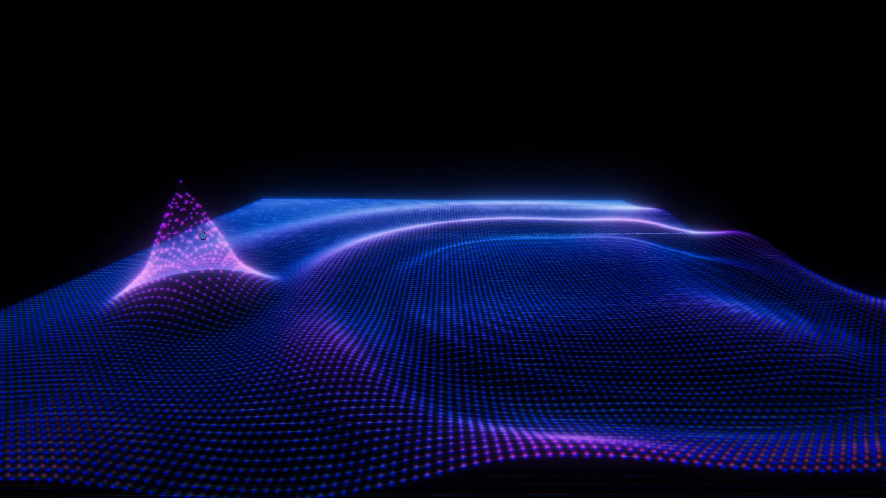

# Dif-E-Q_Net
https://youtu.be/trE9Dmh8H8s

An interactive simulation in Unity. Creates a fluid like effect.

Rotate with right click.
Zoom in using the scroll wheel.
Left click and drag will move points up and down.
Holding space bar will pause the simulation (not perfectly, but good for taking pictures).
Holding f will slow reset the simulation.

Escape to quit.

Adjust the size of the grid if you have performance issues.

